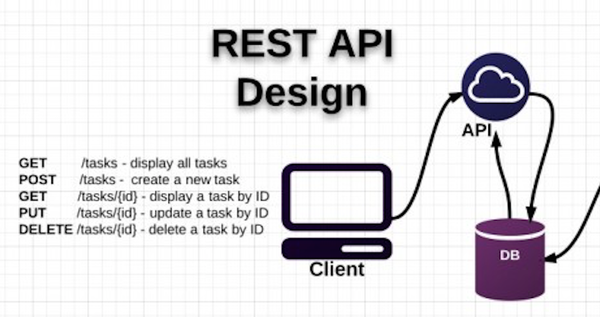

# Retrofit Tutorial

## Getting Started and Creating an Android Client

### Retrofit 是什么？

> A type-safe REST client for Android and Java.

### REST 又是什么？

> REST -- REpresentational State Transfer
> 全称是 Resource Representational State Transfer：通俗来讲就是：资源在网络中以某种表现形式进行状态转移。分解开来：
> 
> - Resource：资源，即数据（前面说过网络的核心）。比如 newsfeed，friends，profile 等；
> - Representational：某种表现形式，比如用 JSON，XML，JPEG 等；
> - State Transfer：状态变化。通过 HTTP 动词实现。
> 
> Server 提供的 RESTful API 中，URL 只使用名词来指定资源，原则上不使用动词。用 HTTP 协议里的动词（GET, POST, PUT, DELETE）来实现资源的添加，修改，删除等状态扭转操作。
> 
> Server 统一提供一套 RESTful API，Web + iOS + Android 作为同等公民调用 API。各端发展到现在，都有一套比较成熟的框架来帮开发者事半功倍。

而 Retrofit 就是 Android 上的一个 REST 框架。[Feature Studio 的 Retrofit 系列教程](https://futurestud.io/learningpaths)最开始演示了一个简单的例子：List public repositories for the specified user, [link](https://developer.github.com/v3/repos/#list-your-repositories):

    GET /users/:username/repos

问题是如何通过 Retrofit 描述这个 API ？
https://api.github.com/users/li2/repos

### How to Describe API Endpoints you want to interact with

    public interface GitHubClient {
        @GET("/users/{user}/repos")
        Call<List<GitHubRepo>> reposForUser(@Path("user") String user);
    }

- The `@GET` annotation: declares that this request uses the HTTP `GET` method.

- The `@Path` annotation: 使用 Retrofit 的路径参数替换功能。
    > the usage of Retrofit's path parameter replacement functionality: the `{user}` path will be replaced with given variable values when calling this method. 

- return `List<GitHubRepo>`: Retrofit makes sure the server response gets mapped correctly, and you won't have to do any manual parsing.（由创建 Retrofit REST client 时指定的 converter 实现）。

### Create a data model class `GitHubRepo` to map the server response data

下面是从 server response data（JSON 文件）中截取的一段：

    [
      {
        "id": 85717178,
        "name": "AndroidTutorial",
      },
      {
        "id": 22966079,
        "name": "Android_I2C_Tool",
      },
      {
        "id": 40343396,
        "name": "Update_Replace_Fragment_In_ViewPager",
      }
    ]

而类的成员变量必须要映射到反馈数据：

    public class GitHubRepo {
        private int id;
        private String name;
        ...
    }

### Create a Retrofit REST Client

[GettingStartedActivity.java](../../app/src/main/java/me/li2/android/tutorial/Retrofit2/L1GettingStarted/GettingStartedActivity.java)

Use the Builder to set some general options for all requests, i.e. the base URL or converter. In most cases requests to a server, and the responses from the server, are not Java objects. They're mapped to some language neutral like JSON.
    
    Retrofit.Builder builder = new Retrofit.Builder()
            .baseUrl(API_BASE_URL)
            .addConverterFactory(GsonConverterFactory.create());
    Retrofit retrofit = builder.build();

Create a client which points the GitHub API endpoint.

    GitHubClient client = retrofit.create(GitHubClient.class);

### Execute Request & Display Data

Use the `client` to get a `call` object:

    Call<List<GitHubRepo>> call = null;

    try {
        // fetch a list of the GitHub repositories
        call = client.reposForUser(USER);
    } catch (Exception e) {
        // missing GSON converter will cause crash:
        // IllegalArgumentException: Unable to create converter for List<GitHubRepo>
        // IllegalArgumentException: Could not locate ResponseBody converter for List<GitHubRepo>
    }

Once you’ve invoked `.enqueue` on the created `call` object **the request will be made by Retrofit**:

    // execute the call asynchronously. get a positive or negative callback.
    call.enqueue(new Callback<List<GitHubRepo>>() {
        @Override
        public void onResponse(Call<List<GitHubRepo>> call, Response<List<GitHubRepo>> response) {
            // the network call was a success and we got a response
            List<GitHubRepo> repos = response.body();
        }

        @Override
        public void onFailure(Call<List<GitHubRepo>> call, Throwable t) {
            // the network call was a failure
        }
    });

## Basics of API Description

### HTTP Method

前面讲过 “用 HTTP 协议里的动词（GET, POST, PUT, DELETE）来实现资源的添加，修改，删除等状态扭转操作”，Retrofit 通过注解来声明：use the appropriate Retrofit annotations for each HTTP method: `@GET`, `@POST`, `@PUT`, `@DELETE`, `@PATCH` or `@HEAD`.

### HTTP Resource Location

在创建 Retrofit REST client 时已经配置了 base URL，而对于每个 HTTP 方法，还需要添加 relative endpoint URL，比如上文的例子 `@GET("/users/{user}/repos")`, 这种方式有很多优点（比如更容易实现 dynamic base URLs）。

但 Retrofit 仍然允许指定 full URL（后文会讲到它的作用）。

### Method Name & Return Type & Parameters

Retrofit 不关心方法名，但仍然需要选择有意义的名字 Nevertheless, you should choose a name, which helps you and other developers to understand what API request this is.

方法的返回类型很重要，You have to define what kind of data you expect from the server:

- `List<GitHubRepo>`: map the server response to data model class
- `ResponseBody`: the raw response
- `Void`: don't care at all what the server responds

可以传递很多种类型的参数：

- `@Body`: send Java objects as request body.
- `@Url`: use dynamic URLs.
- `@Field`: send data as form-urlencoded.

### Path Parameters

**路径参数**是 URL 的一部分，相当于占位符，需要在向 server 发起请求时被替换。这属于 **dynamic URLs**.

REST APIs are build on dynamic URLs. You access the resource by replacing parts of the URL, 比如上文中获取 GitHub 用户 repositories 的例子：https://api.github.com/users/li2/repos ，这个 URL 中的 li2 就是 path parameters：

- `@GET("/users/{user}/repos")`: `{}` 是 URL 占位符，indicates to Retrofit that the value is dynamic and will be set when the request is being made.
- `reposForUser(@Path("user") String user)`: `@Path()` function parameter 是替换占位符的参数, where the @Path value matches the placeholder in the URL.

### Query Parameters

**查询参数**也属于 dynamic URLs. 比如 http://samples.openweathermap.org/data/2.5/weather?q=London&mode=xml&appid=b1b15e88fa797225412429c1c50c122a1 `?` 表示这是查询参数，`?q=London`是第一个查询参数，`mode=xml` 是第二个参数，参数间以 `&` 连接。

查询参数对要请求的资源做了更具体的描述。和路参数不同的是，不需要添加到 annotation URL 中。 You can simply add a method parameter with `@Query()` and a query parameter name, describe the type:

    @GET("http://samples.openweathermap.org/data/2.5/weather/")
    Call<Weather> getLondonWeather(
            @Query("q") String location,
            @Query("mode") String format,
            @Query("appid") String apiKey);

## Reference

- [怎样用通俗的语言解释 REST，以及 RESTful？- 覃超的回答](https://www.zhihu.com/question/28557115/answer/48094438)
- [Feature Studio - Retrofit — Getting Started and Creating an Android Client](https://futurestud.io/tutorials/retrofit-getting-started-and-android-client)
- [Feature Studio - Retrofit Learning Paths](https://futurestud.io/learningpaths)
