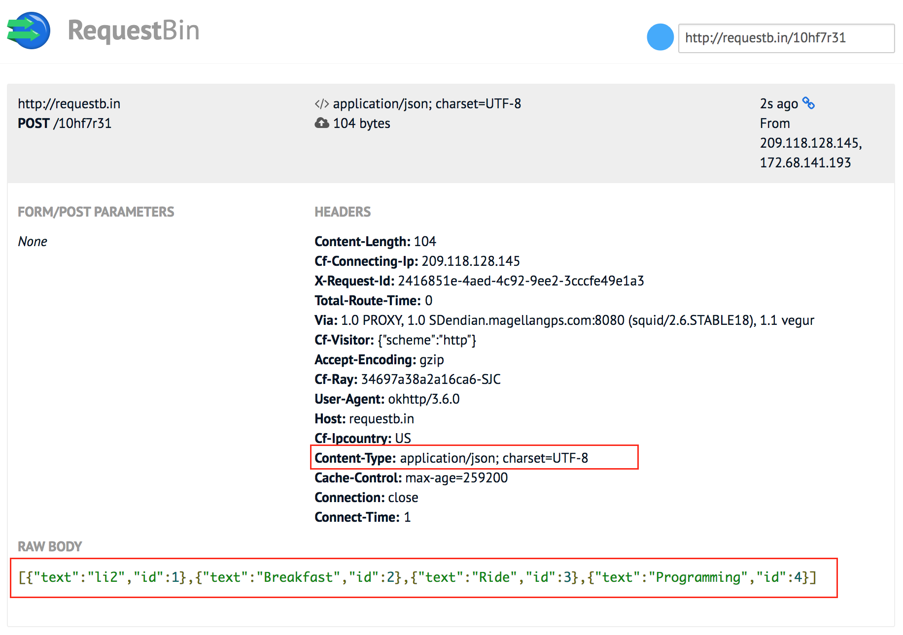
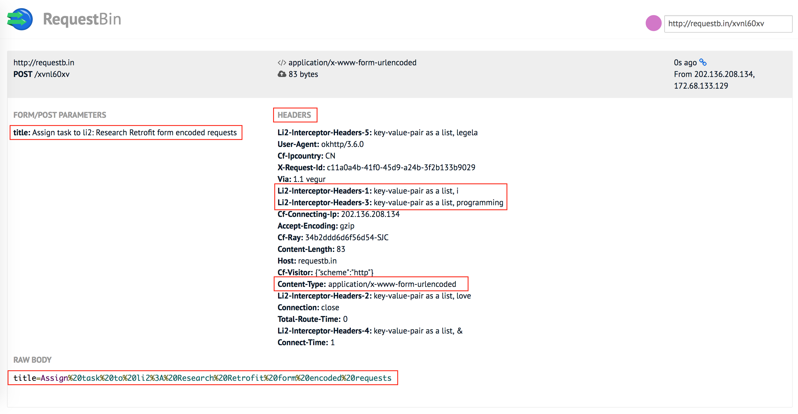
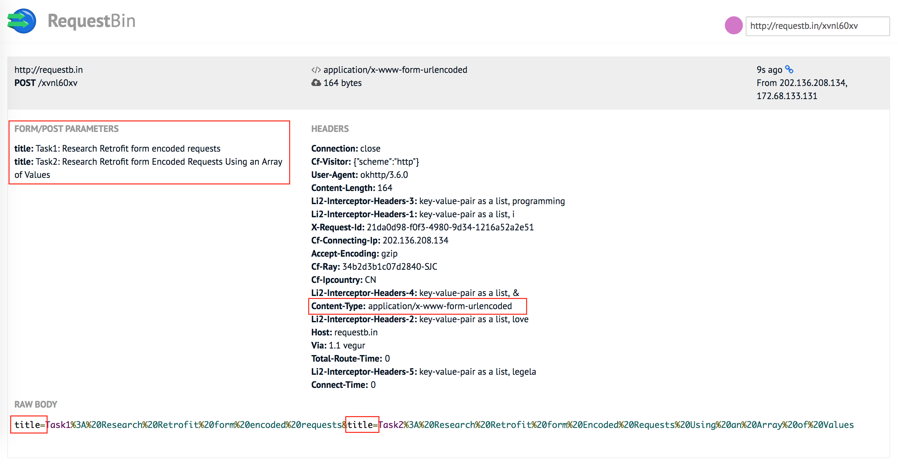
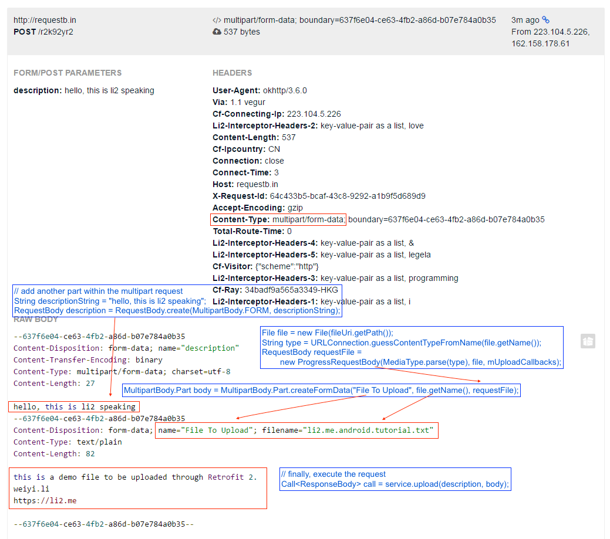

Retrofit Tutorial
=================

# PART A - Create Retrofit Client

In this first part, you’ll learn how to set up your Retrofit client as the base for executing requests.

## L01 - Getting Started and Creating an Android Client

### Retrofit 是什么？

> A type-safe REST client for Android and Java.

### REST 又是什么？

> REST -- REpresentational State Transfer
> 全称是 Resource Representational State Transfer：通俗来讲就是：资源在网络中以某种表现形式进行状态转移。分解开来：
> 
> - Resource：资源，即数据（前面说过网络的核心）。比如 newsfeed，friends，profile 等；
> - Representational：某种表现形式，比如用 JSON，XML，JPEG 等；
> - State Transfer：状态变化。通过 HTTP 动词实现。
> 
> Server 提供的 RESTful API 中，URL 只使用名词来指定资源，原则上不使用动词。用 HTTP 协议里的动词（GET, POST, PUT, DELETE）来实现资源的添加，修改，删除等状态扭转操作。
> 
> Server 统一提供一套 RESTful API，Web + iOS + Android 作为同等公民调用 API。各端发展到现在，都有一套比较成熟的框架来帮开发者事半功倍。

而 Retrofit 就是 Android 上的一个 REST 框架。[Feature Studio 的 Retrofit 系列教程](https://futurestud.io/learningpaths)最开始演示了一个简单的例子：List public repositories for the specified user, [link](https://developer.github.com/v3/repos/#list-your-repositories):

    GET /users/:username/repos

问题是如何通过 Retrofit 描述这个 API ？
https://api.github.com/users/li2/repos

### How to Describe API Endpoints you want to interact with

    public interface GitHubClient {
        @GET("/users/{user}/repos")
        Call<List<GitHubRepo>> reposForUser(@Path("user") String user);
    }

- The `@GET` annotation: declares that this request uses the HTTP `GET` method.

- The `@Path` annotation: 使用 Retrofit 的路径参数替换功能。
    > the usage of Retrofit's path parameter replacement functionality: the `{user}` path will be replaced with given variable values when calling this method. 

- return `List<GitHubRepo>`: Retrofit makes sure the server response gets mapped correctly, and you won't have to do any manual parsing.（由创建 Retrofit REST client 时指定的 converter 实现）。

### Create a data model class `GitHubRepo` to map the server response data

下面是从 server response data（JSON 文件）中截取的一段：

    [
      {
        "id": 85717178,
        "name": "AndroidTutorial",
      },
      {
        "id": 22966079,
        "name": "Android_I2C_Tool",
      },
      {
        "id": 40343396,
        "name": "Update_Replace_Fragment_In_ViewPager",
      }
    ]

而类的成员变量必须要映射到反馈数据：

    public class GitHubRepo {
        private int id;
        private String name;
        ...
    }

### Create a Retrofit REST Client

[GettingStartedActivity.java](../../app/src/main/java/me/li2/android/tutorial/Retrofit2/L1GettingStarted/GettingStartedActivity.java)

Use the Builder to set some general options for all requests, i.e. the base URL or converter. In most cases requests to a server, and the responses from the server, are not Java objects. They're mapped to some language neutral like JSON.
    
    Retrofit.Builder builder = new Retrofit.Builder()
            .baseUrl(API_BASE_URL)
            .addConverterFactory(GsonConverterFactory.create());
    Retrofit retrofit = builder.build();

Create a client which points the GitHub API endpoint.

    GitHubClient client = retrofit.create(GitHubClient.class);

### Execute Request & Display Data

Use the `client` to get a `call` object:

    Call<List<GitHubRepo>> call = null;

    try {
        // fetch a list of the GitHub repositories
        call = client.reposForUser(USER);
    } catch (Exception e) {
        // missing GSON converter will cause crash:
        // IllegalArgumentException: Unable to create converter for List<GitHubRepo>
        // IllegalArgumentException: Could not locate ResponseBody converter for List<GitHubRepo>
    }

Once you’ve invoked `.enqueue` on the created `call` object **the request will be made by Retrofit**:

    // execute the call asynchronously. get a positive or negative callback.
    call.enqueue(new Callback<List<GitHubRepo>>() {
        @Override
        public void onResponse(Call<List<GitHubRepo>> call, Response<List<GitHubRepo>> response) {
            // the network call was a success and we got a response
            List<GitHubRepo> repos = response.body();
            
            // get raw response
            Response raw = response.raw();
        }

        @Override
        public void onFailure(Call<List<GitHubRepo>> call, Throwable t) {
            // the network call was a failure
        }
    });

## L02 - Basics of API Description

### HTTP Method

前面讲过 “用 HTTP 协议里的动词（GET, POST, PUT, DELETE）来实现资源的添加，修改，删除等状态扭转操作”，Retrofit 通过注解来声明：use the appropriate Retrofit annotations for each HTTP method: `@GET`, `@POST`, `@PUT`, `@DELETE`, `@PATCH` or `@HEAD`.

### HTTP Resource Location

在创建 Retrofit REST client 时已经配置了 base URL，而对于每个 HTTP 方法，还需要添加 relative endpoint URL，比如上文的例子 `@GET("/users/{user}/repos")`, 这种方式有很多优点（比如更容易实现 dynamic base URLs）。

但 Retrofit 仍然允许指定 full URL（后文会讲到它的作用）。

### Method Name & Return Type & Parameters

Retrofit 不关心方法名，但仍然需要选择有意义的名字 Nevertheless, you should choose a name, which helps you and other developers to understand what API request this is.

方法的返回类型很重要，You have to define what kind of data you expect from the server:

- `List<GitHubRepo>`: map the server response to data model class
- `ResponseBody`: the raw response
- `Void`: don't care at all what the server responds

可以传递很多种类型的参数：

- `@Body`: send Java objects as request body.
- `@Url`: use dynamic URLs.
- `@Field`: send data as form-urlencoded.

### Path Parameters

**路径参数**是 URL 的一部分，相当于占位符，需要在向 server 发起请求时被替换。这属于 **dynamic URLs**.

REST APIs are build on dynamic URLs. You access the resource by **replacing parts of the URL**, 比如上文中获取 GitHub 用户 repositories 的例子：https://api.github.com/users/li2/repos ，这个 URL 中的 li2 就是 path parameters, the `{user}` path will be replaced with given variable values when calling this method:

- `@GET("/users/{user}/repos")`: `{}` 是 URL 占位符，indicates to Retrofit that the value is dynamic and will be set when the request is being made.
- `reposForUser(@Path("user") String user)`: `@Path()` function parameter 是替换占位符的参数, where the @Path value matches the placeholder in the URL.

### Query Parameters

**查询参数**也属于 dynamic URLs. 比如 http://samples.openweathermap.org/data/2.5/weather?q=London&mode=xml&appid=b1b15e88fa797225412429c1c50c122a1 `?` 表示这是查询参数，`?q=London`是第一个查询参数，`mode=xml` 是第二个参数，参数间以 `&` 连接。

查询参数对要请求的资源做了更具体的描述（further describes the request resource）。和路参数不同的是，不需要添加到 annotation URL 中。 You can simply add a method parameter with `@Query()` and a query parameter name, describe the type, Retrofit will automatically **attach it to the request**:

    @GET("http://samples.openweathermap.org/data/2.5/weather/")
    Call<Weather> getLondonWeather(
            @Query("q") String location,
            @Query("mode") String format,
            @Query("appid") String apiKey);

## L03 - Creating a Sustainable Android Client

创建一个 Retrofit Client 需要做一些基本配置，比如 base URL, converter，如果项目中有很多请求 (have dozens of network requests throughout your app)，最佳实践是把这些配置封装成一个类 separating into one clean class [ServiceGenerator.java](../../app/src/main/java/me/li2/android/tutorial/Retrofit2/L3CreatingSustainableClient/ServiceGenerator.java)：

    public class ServiceGenerator {
        private static Retrofit retrofit = builder.build();
        
        // 入口参数 serviceClass 是 annotated interface for API requests,
        // 比如上文中的 public interface GitHubClient.
        public static <S> S createService(Class<S> serviceClass) {
            return retrofit.create(serviceClass);
        }
    }

然后用一行代码就可以创建一个 Retrofit REST client:

    GitHubClient client = ServiceGenerator.createService(GitHubClient.class);
    

# PART B - Sending Your First Request

In this part you’ll use the Retrofit client to execute your first requests.

## L04 - Synchronous and Asynchronous Requests

Within Retrofit 2, every request is wrapped into a `Call` object. The actual synchronous or asynchronous request is executed differently using the desired method on a later created `call` object. 使用相同的 API 定义获取 call, 然后调用 call 的不同方法实现同步、异步。

Synchronous methods provide the ability to use the return value directly, because the operation blocks everything else during your network request.

synchronous requests trigger app crashes on Android 4.0 or newer. You’ll run into the `NetworkOnMainThreadException` error, so you have to handle the request execution in a separated thread by yourself.

    // execute(): Synchronously send the request and return its response.
    List<GitHubRepo> repos = call.execute().body();

    // enqueue(): Asynchronously send the request and notify callback of its response.
    // 参考上文的具体实现.
    call.enqueue(new Callback<List<GitHubRepo>>() {
        ...
    }
    

## L05 - URL Handling, Resolution and Parsing

Retrofit handles the relationship between API base URL and request endpoint URL in a logical manner. You’ll learn in detail how Retrofit assembles complete URLs.

### `baseUrl` Resolution

在代码中定义一个 baseUrl，Retrofit 会把 endpoint 定义的 a relative path address 附加到 baseUrl，组成一个完整的 url。**最佳实践是在 baseUrl 尾部包含斜杠**。

Using Retrofit, you're requesting a specific API that always has the same base address. This base address shares the same scheme and host and you can define it in a single place (using `Retrofit.Builder()`) and change it there if necessary without touching every endpoint in your app.

The base url is used for every request and any endpoint value. You should always end your base url with a trailing slash: `/`.

    # Good Practice
    base url: https://futurestud.io/api/
    endpoint: my/endpoint
    Result:   https://futurestud.io/api/my/endpoint
    
    # Bad Practice
    base url: https://futurestud.io/api
    endpoint: /my/endpoint
    Result:   https://futurestud.io/my/endpoint

### Absolute Urls

如果 web API 升级， 只需要改变 baseUrl，从 v2 变为 v3，所有的 endpoints 都会自动使用新的 url 进行 request，Example 1 演示了这种情况。

但仍希望特别的 endpoint 仍使用 v2 API，解决方案是使用 absolute url，Example 2 演示了这种情况（即上文代码中 endpoint 的 bad practice）。
this technique might be necessary in your app to call the appropriate endpoints. To rely on selected v2 endpoints, you can use an absolute url to directly specify an API version.

    # Example 1
    base url: https://futurestud.io/api/v3/
    endpoint: my/endpoint
    Result:   https://futurestud.io/api/v3/my/endpoint
    
    # Example 2
    base url: https://futurestud.io/api/v3/
    endpoint: /api/v2/another/endpoint
    Result:   https://futurestud.io/api/v2/another/endpoint

### Dynamic Urls or Passing a Full Url

Example 3 用一个 complete url 替换了 baseUrl，特别适用于这种情况：需要从另一个 server 下载文件
`Example 3` shows you the replacement of the base url when using a completely different one. This example is useful when requesting files or images that have different locations, like some files are on your own server and others are stored on Amazon’s S3.

Example 4 用一个子域名替换了 baseUrl，但仍使用 baseUrl 定义的 https://
In `Example 4`, we’re not using the path segment for the API, but instead a subdomain. We still want to keep the previously defined scheme and therefore just pass the full url with leading `//`.

    # Example 3 — completely different url
    base url: http://futurestud.io/api/ 
    endpoint: https://api.futurestud.io/
    Result:   https://api.futurestud.io/
    
    # Example 4 — Keep the base url’s scheme
    base url: https://futurestud.io/api/
    endpoint: //api.futurestud.io/
    Result:   https://api.futurestud.io/

## L06 - Send Objects in Request Body

[Demo Codes](../../app/src/main/java/me/li2/android/tutorial/Retrofit2/L5SendObjectsInRequestBody)

Learn how to define and send Java objects in an HTTP request body with Retrofit. Sending data to the server is one of the most fundamental tasks of Retrofit.

参考「Basics of API Description」，`@Body` 是可以传递的参数类型之一：

    public interface TaskService {
        @POST("http://requestb.in/10hf7r31")
        Call<String> createTasks(@Body List<Task> tasks);
    }

    private void createTasks() {
        List<Task> tasks = new ArrayList<>();
        int id=1;
        tasks.add(new Task(id++, "li2"));
        tasks.add(new Task(id++, "Programming"));

        TaskService taskService = ServiceGenerator.createService(TaskService.class);
        taskService.createTasks(tasks).enqueue(new Callback<String>() {
        });
    }

[RequestBin](http://requestb.in/) 是一个非常棒的免费网站，可以用来测试 POST 请求。使用方法也很简单，进入网站，点击「+Create a RequestBin」得到一个 url，用来接收 POST 请求；然后通过浏览器观察 post 数据。测试结果见下图：

> RequestBin is a HTTP test server that accepts GET/Post calls for testing POST requests.
> RequestBin gives you a URL that will collect requests made to it and let you inspect them in a human-friendly way. [link](http://stackoverflow.com/a/9770981/2722270)

最开始 API 定义是这样的导致了 crash:

    Call<Task> createTasks(@Body List<Task> tasks);
    java.lang.IllegalStateException: Expected BEGIN_ARRAY but was STRING at line 1 column 1 path $

一定要严格定义 API 中的返回类型 `Call<返回类型>`，因为其代表了服务器的 response type。如果服务器返回的是 String，而 API 定义了 Call<Task>, 就会导致crash，这是因为 Retrofit 和 Gson 无法把 String 映射成 Java 对象。

> The type in the Call<> describes the server response type. Your first option says the server should respond with a JSON object. http://requestb.in/10hf7r31 responds with a string, so Retrofit and Gson can't map that to a Java object. The second option with Call<void> ignores the server response and doesn't do any mapping. That's why you won't run into an issue.
>
> On the other hand, the method's return type is critical. You have to define what kind of data you expect from the server. If you don't care at all what the server responds, you can use Void. In all those cases, you'll have to wrap it into a typed Retrofit Call<> class.
> 
> Answer from FutureStudio: http://disq.us/p/1hdcx4v

# PART C - Payload Conversion

In this part you’ll learn how to convert request and response payloads with Retrofit.

## L07 - Introduction to (Multiple) Converters

Get to know all provided standard converters and how to use them for mapping from and to various standard formats.

## L08 - Adding & Customizing the Gson Converter

Learn how to integrate and customize the Gson converter to map all of your JSON request and responses automatically.

## L09 - How to Integrate XML Converter

[Demo Codes](../../app/src/main/java/me/li2/android/tutorial/Retrofit2/L9IntegrateXMLConverter)

这里使用 [OpenWeather](https://openweathermap.org/current#current_XML) 作为测试 Server，它提供了测试数据（[JSON](http://samples.openweathermap.org/data/2.5/weather?q=London&appid=b1b15e88fa797225412429c1c50c122a1) & [XML](http://samples.openweathermap.org/data/2.5/weather?q=London&mode=xml&appid=b1b15e88fa797225412429c1c50c122a1)），因此不需要注册获取 API key 就可以调用 Server API 了。

使用 `SimpleXML` converter 把 XML 文件映射为 Java object，这里的**关键是根据 XML 文件定义 Java Class**（目前还未找到自动转换工具，Gsonformat 是一个 Android Studio 插件，可以转换 GSON file 到 Java Class），使用 `@Root`, `@Element`, `@Attribute`，细节参阅 [link](http://www.vogella.com/tutorials/Retrofit/article.html#exercise-using-retrofit-to-convert-xml-response-from-an-rss-feed)。

遇到一个 crash，涉及 Dealing with Multiple Converters：[commit](1583211)

     com.google.gson.JsonSyntaxException: java.lang.IllegalStateException: Expected BEGIN_OBJECT but was STRING at line 1 column 1 path $

原因：

> The GsonConverter thinks it can handle any data and (mistakenly) also accept XML data.
> When dealing with Multiple Converters, make sure to add `SimpleXmlConverter` before the `GsonConverter`, to support both XML and JSON within your app.
> 
> Make sure you specify the special-purpose converters with limited abilities first and general converters (like Gson) last. [link1](http://disq.us/p/1fuwzgz), [link2](https://speakerdeck.com/jakewharton/making-retrofit-work-for-you-ohio-devfest-2016)

缺少 GSON converter 造成的 crash，`List<GitHubRepo>` 是 API 的返回数据类型：

    IllegalArgumentException: Unable to create converter for List<GitHubRepo>
    IllegalArgumentException: Could not locate ResponseBody converter for List<GitHubRepo>

# PART D - Developer Utilities

In this part you’ll learn how to analyze Retrofit’s behavior.

## L10 - Log Requests and Responses

You want to know what exactly Retrofit is receiving and sending to your server? Learn how to add a logging interceptor to your Android app.



# PART E - Request Manipulation & Files

In this final part you’ll learn a variety of request manipulations, including sending files.

## L11 - Query Parameters

[Demo Codes](../../app/src/main/java/me/li2/android/tutorial/Retrofit2/L11QueryParameters)

Learn how to use Retrofit to add (optional / multiple) query parameters to your requests. 参考「Basics of API Description」dynamic URLs 包含路径参数和查询参数。

### Optional query parameters

查询参数是一种动态 url 技术，把 `@Query("key")` 携带的 key 和方法的参数组合成 key-value，然后添加到 url 中。

可以传入 `null` 参数，Retrofit skips null parameters and ignores them while assembling the request. 但 cannot pass `null` for primitive data types like `int`, `float`, `long`, etc, 所以 API 定义 API 时要使用 `Integer`, `Float`, `Long` 代替。

### Add multiple query parameter with QueryMap

如果参数很多时，使用`QueryMap` annotation which is a better solution to work with complex API endpoints having various options for query parameters:

    public interface WeatherService {
        @GET("http://samples.openweathermap.org/data/2.5/weather/")
        Call<Weather> getLondonWeather(@QueryMap Map<String, String> options);
    }
    
    //?q=London&mode=xml&appid=b1b15e88fa797225412429c1c50c122a1
    
    Map<String, String> options = new HashMap<>();
    options.put("q", "London");
    options.put("mode", "xml");
    options.put("appid", "b1b15e88fa797225412429c1c50c122a1");
    call = weatherService.getLondonWeather(options);    

**如果屏蔽 `put("mode", ...)` 会导致 RuntimeException**：

    org.xmlpull.v1.XmlPullParserException: Unexpected token (position:TEXT {"coord":{"lon":...

Request url 不包含 `&mode=xml`, 所以 response data 是 Json 格式，而试图解析的 converter 是 SimpleXML，所以抛出了上述异常。API 定义的返回数据类型 Call<Weather> 也是针对 XML 格式的，所以该 API 被调用后期望的反馈数据就是 xml 了。

如何解决这种问题呢？ TODO

## L12 - Path Parameters

Learn how to use (optional) path parameters to refine your request for single or multiple values.

By passing an empty String to path parameter, Retrofit (especially OkHttp’s HttpUrl class) will “remove” the path parameter and just use the leading url part for the request.
If your path parameter is right in the middle of the url, **passing an empty string will result in a wrong request url**:

    public interface GitHubClient {
        @GET("/users/{user}/repos")
        Call<List<GitHubRepo>> reposForUser(@Path("user") String user);
    }

    https://api.github.com/users//repos

和查询参数不同的是，**不能传给路径参数 `Null`**, 否则 `IllegalArgumentException`, 所以 Ensure stability by verifying that the path parameter values are always not null.

## L13 - Add Custom Request Header

Does your API require you to send the same header on every request? Do you want to fine tune caching? Learn how how to add custom headers to your requests.

Request header 是什么？ **Headers containing more information about the resource to be fetched or about the client itself**. [link](https://developer.mozilla.org/en-US/docs/Glossary/Request_header)

### Static Request Header

Create a Request Interceptor, and intercept the request on the network layer provided by OkHttp. These headers are passed with **every request**. Headers can be key-value-pair as one string or as a list of strings. 
[Demo Codes: ServiceGenerator.java](../../app/src/main/java/me/li2/android/tutorial/Retrofit2/L3CreatingSustainableClient/ServiceGenerator.java)

### Dynamic Header

A dynamic header is passed like a parameter to the **each request** API. [link](https://futurestud.io/tutorials/retrofit-add-custom-request-header)
[Demo Codes: WeatherService.java](../../app/src/main/java/me/li2/android/tutorial/Retrofit2/L11QueryParameters/WeatherService.java)

测试结果可以参考下一节内容「Send Data Form-Urlencoded」的图片。

## L14 - Send Data Form-Urlencoded

[Demo Codes](../../app/src/main/java/me/li2/android/tutorial/Retrofit2/L14SendDataFormUrlencoded)

「Basics of API Description」讲到方法可以传递的几种参数类型，本节讲解 `@Field`: send data as form-urlencoded.

只需要添加注解 `@FormUrlEncoded`，which will adjust the proper mime type of your request automatically to application/x-www-form-urlencoded. 

    public interface TaskService {
        @FormUrlEncoded
        @POST("http://requestb.in/xvnl60xv")
        Call<String> createTask(@Field("title") String title);
    
        @FormUrlEncoded
        @POST("http://requestb.in/xvnl60xv")
        Call<String> createTasks(@Field("title") List<String> titles);
    }

还需要用注解 `@Field` 传递参数，仍然是 key-value-pair，
可以传递一个：

也可以传递一个 List (with same key)：

### Form-Urlencoded vs. Query Parameter

"What is the difference between form-urlencoded and query parameters?". In essence: the **request type**.

- form-urlencoded: `POST`, are used to send data to a server or API. The data is sent within the request body and not as an url parameter.
- query parameter: `GET`, are used when requesting data from an API or server using specific fields or filter.

## L15 - Upload Files to Server

[Demo Codes](../../app/src/main/java/me/li2/android/tutorial/Retrofit2/L15UploadFiles)

Does your app allow photo or video upload? Learn how to upload files to a server using Retrofit. We can also POST file to http://requestb.in, amazing !

the interface definition for file uploads:

    public interface FileUploadService {
        @Multipart
        @POST("http://requestb.in/r2k92yr2")
        Call<ResponseBody> upload(
                @Part("description") RequestBody description,
                @Part MultipartBody.Part file
        );
    }
    
上传一个 Txt 文档的测试结果（教程只讲了怎样做，没有讲为什么这样做）：

[Is it possible to show progress bar when upload image via Retrofit 2?](http://stackoverflow.com/a/33384551/2722270)

## Reference

- [怎样用通俗的语言解释 REST，以及 RESTful？- 覃超的回答](https://www.zhihu.com/question/28557115/answer/48094438)
- [Feature Studio - Retrofit — Getting Started and Creating an Android Client](https://futurestud.io/tutorials/retrofit-getting-started-and-android-client)
- [Feature Studio - Retrofit Learning Paths](https://futurestud.io/learningpaths/retrofit-basics)
- [Using Retrofit to convert XML response from an RSS feed](http://www.vogella.com/tutorials/Retrofit/article.html#exercise-using-retrofit-to-convert-xml-response-from-an-rss-feed)
- [Simple XML Tutorial](http://simple.sourceforge.net/download/stream/doc/tutorial/tutorial.php)

[MIME](https://en.wikipedia.org/wiki/MIME) (Multipurpose Internet Mail Extensions) is an Internet standard that extends the format of email to support（描述消息内容类型的因特网标准。MIME 消息能包含文本、图像、音频、视频以及其他应用程序专用的数据）：

- Text in character sets other than ASCII
- Non-text attachments: audio, video, images, application programs etc.
- Message bodies with multiple parts
- Header information in non-ASCII character sets

[A media type](https://en.wikipedia.org/wiki/Media_type) (also MIME type and content type)[1] is a two-part identifier for file formats and format contents transmitted on the Internet, examples:

- `application/x-www-form-urlencoded`: to send simple text/ ASCII data.
- `multipart/form-data`: to send non-ASCII text or large binary data.

[HTTP Message Body](https://en.wikipedia.org/wiki/HTTP_message_body) is the data bytes transmitted in an HTTP transaction message immediately following the headers if there is any.

